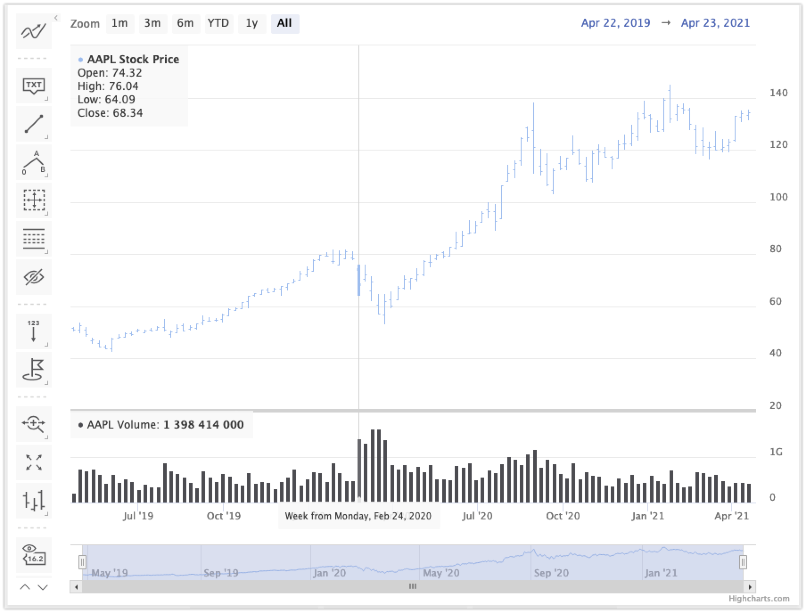
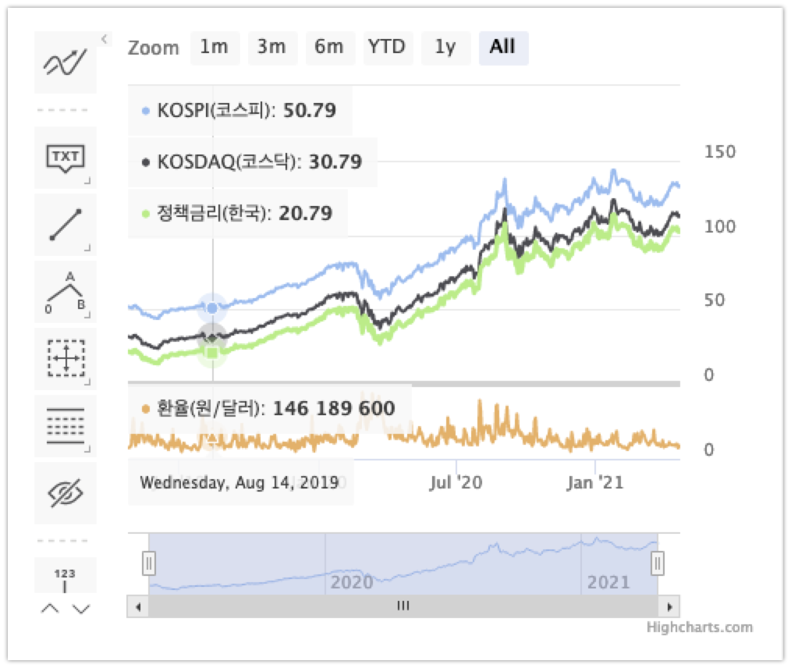

# WORKLOG

# 2021/03/30

몽고DB에 코스피 데이터 인서트 작업을 마쳤고 차트 로직을 연동했다. 

이번 주 내로 아직 더 해야 하는 일들의 목록은 아래와 같다.

- 차트 스타일을 조금 손을 봐야 한다.(조금 많이, 자주 하게될수도)
- 추가적인 데이터(정책금리-한국,미국, 환율) INSERT
- 시간 조건검색 기능 기획하기
- 웹플럭스 검토

오늘 까지 한 내용은 아래와 같다.

- 몽고DB, 코스피 데이터 연동, 차트 렌더링 로직 작성

# 2021/03/31

오늘까지 완료한 amchart 로직이다. highchart로 변경예정이다. ([참고할 Highchart 예제](https://www.highcharts.com/demo/stock/candlestick-and-volume))

- 데이터 축이 amchart와 highchart는 서로 다르다. amchart를 사용할 경우 모든 데이터를 서버에서 병합해서 가져와야 한다는 단점이 있다.  
- highchart의 경우 데이터를 단건으로 따로 들고와서 js 단에서 병합해도 되고, 공통적인 고정 시간 축만 있다면 차트 안에서 시간축으로 인한 오류가 나지 않는다.

# 2021/04/02

코스피, 정책금리(한국), 정책금리(미국) 를 날짜 검색 조건을 전달받아 Controller, Service, Repository 코드를 통해 결과를 조회하는 로직을 작성했다. 테스트 코드 역시 작성완료했다.  

앞으로 경제지표 Dto는 아래의 세가지의 성격으로 구분지어 매핑하도록 하려 계획중이다. 

- PriceDto
  - 원/달러, 위안/달러
  - 금, 은, WTI
- IndexDto
  - 인덱스 지표(KOSPI, NASDAQ 등등)
- PercentDto
  - 정책금리

이 Dto들을 생성해주는 빌더 로직을 공통화할 예정인데, 기본적인 화면과, 기능이 완성되면 빌더 로직 공통화 작업을 시작하게 될 것 같다.

# 2021/04/27

한동안 코딩테스트와 면접준비를 하느라 손댈 엄두를 못하고 있었다. 오늘 간만에 짬이 나서 highchart 렌더링 로직을 얼른 해야 겠다는 생각으로 시작했다. 

**ohlc 차트 타입 발견**  

우선 내가 다루려고 하는 주제는 경제지표인데, 이것은 주식 차트와 기능이 많이 닮아있다. 그리고 오늘 ohlc 라는 차트 타입을 처음으로 알았다. ohlc 라는 타입은 어디서 먼저 정했는지는 모르겠지만, 캔들스틱을 표현하기 위한 차트 타입이다.  

- ohlc
  - `o` : open
  - `h` : high
  - `l` : low
  - `c` : close

ohlc 는 위와 같은 단어들의 약자이다. 하이차트는 여러번 써봤지만, ohlc라는 차트 타입은 처음봤다.  

주식 차트들을 위한 데모 페이지는 [여기](https://www.highcharts.com/demo/stock) 이다. 

 

이 중에서 나는 아래의 [예제](https://www.highcharts.com/demo/stock/stock-tools-gui) 를 선택해서 차트 타입을 바꿔가며 커스터마이징 하기로 결정했다.

 

위의 예제 말고도 [여기](https://www.highcharts.com/demo/stock/all-indicators) , [여기](https://codepen.io/pen/) 를 활용해서 조금 더 복잡하게 만들 계획이다. 

 

**기획** 

- 차트 타입 선정 (Line 으로 통일)
  - 경제지표의 추이를 표현하는 것은 시가,종가보다는 트렌딩이 더 중요하다. 이런 이유로 캔들 스틱보다는 라인차트의 형식으로 표현할 예정이다.
- 데이터 축 기준 선정
  - 첫번째 차트 : 원화기반의 경제지표 (코스피, 코스닥, 한국금리)
  - 두번째 차트 : 통화 교환 지표 (원/달러, 위안/달러)
  - 세번째 차트 : 원자재 가격 지표 (금, 은, WTI)

이렇게 할 예정이다. 세번째 차트의 경우는 데이터를 구하기 어려운 관계로 인해, 구하기 조금 어렵다 싶으면 접을 예정이다. 첫번째 차트와 두번째 차트의 기능을 단순하게 완성시킨 후에 여러가지 지표를 라디오 박스로 체크해가며 차트를 표현하는 기능 역시 추가 예정이다. 

 

**차트연습 본** 

우선 일단, 오늘까지는 highchart 에서 제공하는 샘플데이터를 활용해서 아래와 같은 모습까지는 완료하였다. ([JSFIDDLE 링크](https://jsfiddle.net/gosgjung/0nkobuLp/28/)) 

내일부터 작성할 JSFIDDLE 은 복제해서 새로운 버전으로 새로 작성할 예정이다. 

 

