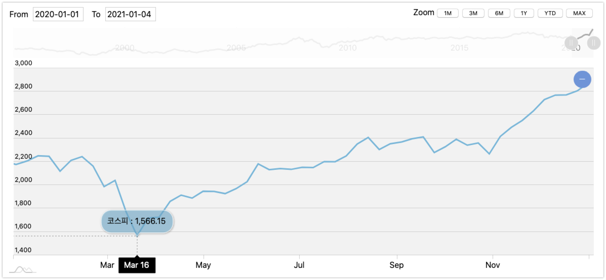

# WORKLOG

# 2021/03/30

몽고DB에 코스피 데이터 인서트 작업을 마쳤고 차트 로직을 연동했다. 

이번 주 내로 아직 더 해야 하는 일들의 목록은 아래와 같다.

- 차트 스타일을 조금 손을 봐야 한다.(조금 많이, 자주 하게될수도)
- 추가적인 데이터(정책금리-한국,미국, 환율) INSERT
- 시간 조건검색 기능 기획하기
- 웹플럭스 검토

오늘 까지 한 내용은 아래와 같다.

- 몽고DB, 코스피 데이터 연동, 차트 렌더링 로직 작성

# 2021/03/31

오늘까지 완료한 amchart 로직이다. highchart로 변경예정이다. ([참고할 Highchart 예제](https://www.highcharts.com/demo/stock/candlestick-and-volume))

- 데이터 축이 amchart와 highchart는 서로 다르다. amchart를 사용할 경우 모든 데이터를 서버에서 병합해서 가져와야 한다는 단점이 있다.  
- highchart의 경우 데이터를 단건으로 따로 들고와서 js 단에서 병합해도 되고, 공통적인 고정 시간 축만 있다면 차트 안에서 시간축으로 인한 오류가 나지 않는다.

