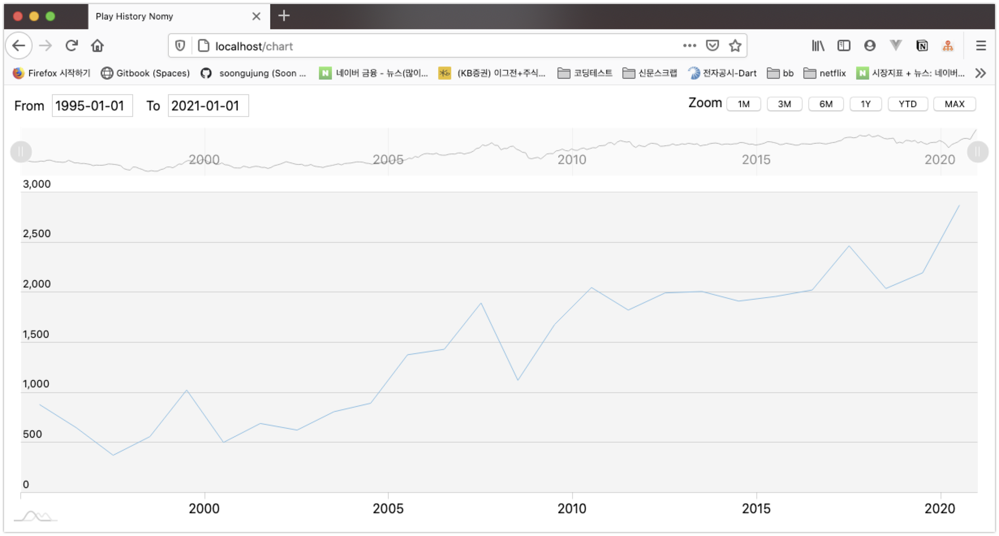

# WORKLOG

## 2021/03/30

몽고DB에 코스피 데이터 인서트 작업을 마쳤고 차트 로직을 연동했다. 

이번 주 내로 아직 더 해야 하는 일들의 목록은 아래와 같다.

- 차트 스타일을 조금 손을 봐야 한다.(조금 많이, 자주 하게될수도)
- 추가적인 데이터(정책금리-한국,미국, 환율) INSERT
- 시간 조건검색 기능 기획하기
- 웹플럭스 검토

오늘 까지 한 내용은 아래와 같다.

- 몽고DB, 코스피 데이터 연동, 차트 렌더링 로직 작성

